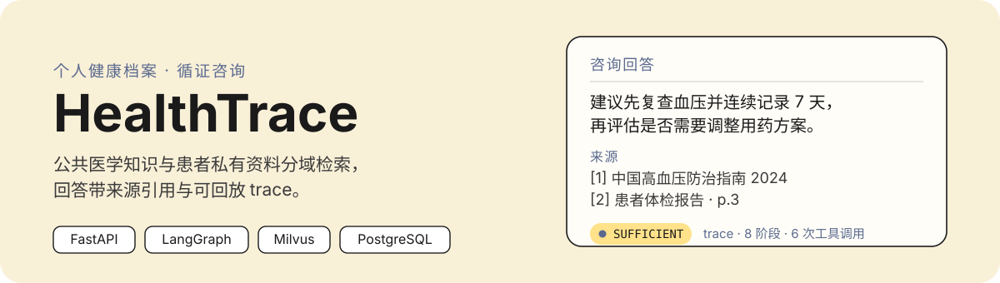
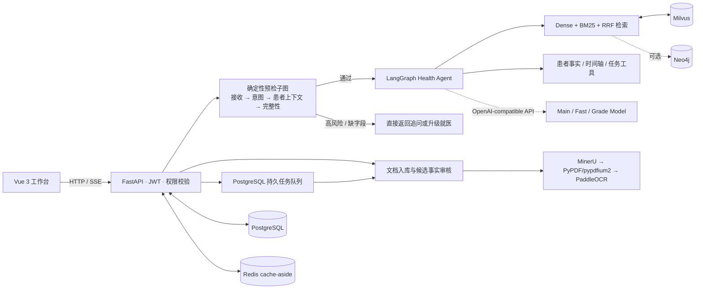

<p align="center">
  
</p>

# HealthTrace

面向个人用户的健康档案管理与循证咨询系统。它把公共医学知识与患者私有资料分域处理，通过 FastAPI、Vue、LangGraph 和混合检索提供带来源的回答，并将患者文档中的候选事实交给用户审核后再写入健康时间轴。

[](https://www.python.org/)
[](https://fastapi.tiangolo.com/)
[](https://vuejs.org/)
[](LICENSE)

> **免责声明**：HealthTrace 目前用于工程研究与医学知识辅助，不提供诊断、处方、药物剂量调整或急救决策，不能替代医生。仓库中的评测结果也不代表临床有效性。

## 项目解决什么问题

- 公共知识和患者资料使用独立的数据边界、检索工具与 Milvus collection，患者查询强制携带 tenant/patient scope。
- 咨询请求先经过确定性预检；高风险症状和关键资料缺失会在调用主 LLM 前被拦截。
- 回答保留检索引用和执行 trace；证据不足、冲突或依赖失败时执行明确的追问、拒答、降级或升级就医策略。
- 患者报告先生成待审核候选事实，只有用户确认后才转成 FHIR-like 健康事实和纵向时间轴事件。
- 文档解析、患者索引、删除和 Agent 评测由 PostgreSQL 持久任务队列异步执行，支持幂等键、重试和陈旧任务恢复。

## 快速开始

### 环境要求

- Python 3.12
- Node.js 与 npm
- Docker Desktop（仅 `managed` 基础设施模式需要）

Windows 可运行：

```cmd
git clone https://github.com/ttsdj/HealthTrace.git
cd HealthTrace
setup.bat
```

`setup.bat` 会创建 `.venv`、安装后端和前端依赖、从 `.env.example` 生成本地 `.env`，并生成本地 JWT 与字段加密密钥。不要提交生成的 `.env`。

手动安装：

```cmd
python -m venv .venv
.venv\Scripts\python.exe -m pip install -U pip
.venv\Scripts\python.exe -m pip install -e ".[dev]"
npm --prefix frontend ci
copy .env.example .env
```

如需本地 OCR，再安装可选依赖：

```cmd
.venv\Scripts\python.exe -m pip install -e ".[ocr]"
```

### 配置

`.env.example` 列出全部参数。最少需要按本地环境设置：

```env
LLM_API_KEY=replace-with-your-key
BASE_URL=https://your-openai-compatible-endpoint/v1
MODEL=replace-with-main-model
FAST_MODEL=replace-with-fast-model
GRADE_MODEL=replace-with-grade-model
JWT_SECRET_KEY=replace-with-a-long-random-value
HEALTHTRACE_FIELD_ENCRYPTION_KEY=replace-with-url-safe-base64-32-byte-key
```

基础设施有两种模式：

- `HEALTHTRACE_INFRA_MODE=managed`：由仓库的 Docker Compose 启动 PostgreSQL、Redis、Milvus、etcd、MinIO 和 Attu。
- `HEALTHTRACE_INFRA_MODE=external`：只连接 `.env` 中指定的既有服务，不启动或修改其容器卷。

默认意图路由是 `HEALTHTRACE_INTENT_ROUTER_MODE=rules`。可切换为 `lora`/`lora_fastmodel`/`auto` 以启用 LoRA-BERT 层；该层在未装 `peft` 或无 adapter 时回退规则。只有配置的小模型通过冻结验收集并满足超时要求后，才建议切换为 `fastmodel`。

### 启动

```cmd
start.bat
```

默认地址：

| 服务 | 地址 |
| --- | --- |
| 前端 | http://127.0.0.1:3000 |
| FastAPI | http://127.0.0.1:8000 |
| OpenAPI | http://127.0.0.1:8000/docs |
| 健康检查 | http://127.0.0.1:8000/health |
| Attu（Milvus 控制台） | http://127.0.0.1:8080 |
| PostgreSQL / Redis | 127.0.0.1:5432 / 6379 |
| Milvus / MinIO | 19530 与 9091 / 9000 与 9001 |

手动启动后端：

```cmd
docker compose up -d
.venv\Scripts\python.exe scripts\init_db_safe.py
.venv\Scripts\python.exe -m uvicorn backend.app:app --host 127.0.0.1 --port 8000
```

前端开发服务器：

```cmd
npm --prefix frontend run dev
```

容器化运行（含应用本身）：

```cmd
docker compose -f docker-compose.yml -f docker-compose.app.yml up -d --build
```

## 当前架构



主要目录：

| 目录 | 职责 |
| --- | --- |
| `frontend/` | Vue 3、TypeScript、Pinia 用户界面 |
| `backend/api/` | FastAPI 路由、JWT、SSE、权限边界 |
| `backend/agent/` | 咨询状态机、Evidence State 与 Action Policy |
| `backend/rag/` | 查询规划、并发检索、证据评级与降级 |
| `backend/indexing/` | 解析、三级父子分块、Embedding 与 Milvus 写入 |
| `backend/patient/` | tenant/patient scope、事实抽取、时间轴与趋势 |
| `backend/medical_nlp/` | 脱敏、意图分类与医学文本处理 |
| `backend/jobs/` | PostgreSQL 任务领取、执行、重试与恢复 |
| `backend/kg/` | Neo4j 患者时序健康图谱（默认关闭） |
| `backend/security/` | 字段加密、审计中间件与限流 |
| `backend/observability/` | Prometheus 指标与可选 OTLP 出口 |
| `backend/evaluation/` | Agent、RAGCare、RAGAS、MIRAGE 评测代码 |
| `evaluation/` | 冻结的意图路由与 Agent 策略数据集 |
| `tests/` | 单元、集成与回归测试 |
| `docs/` | 实现审计、数据模型、迁移与实验证据 |

CI 在 `.github/workflows/ci.yml`（pytest、compileall、前端构建、仓库安全检查、compose 配置校验）与 `.github/workflows/container.yml`（打 `v*` tag 时构建并推送 GHCR 镜像，带 provenance 与 SBOM）。

## 实现状态

| 能力 | 状态 | 说明 |
| --- | --- | --- |
| 用户、会话与消息持久化 | IMPLEMENTED | SQLAlchemy/PostgreSQL；Redis cache-aside 用于减少热点重复查询 |
| 咨询阶段状态机 | IMPLEMENTED | 8 个 `ConsultationStage` 枚举与 7 类 Evidence State、6 类 Agent Action 均落库并写入 trace。执行拓扑上目前是**两个 LangGraph 子图**（4 节点预检 + 3 节点收尾），中间隔着一次未入图的 LLM 调用，不是单张 8 节点图 |
| 三层意图路由 | IMPLEMENTED | 规则 → LoRA-BERT → LLM：确定性规则默认；LoRA-BERT 为可选层（`backend/medical_nlp/intent_classifier.py`），未装 `peft` 或无 adapter 时自动回退规则；FastModel JSON/Pydantic 路由失败亦回退。任何模型层都不能授予写能力。LoRA 分类代码与训练脚本就绪，adapter 尚未训练 |
| 公共知识混合检索 | IMPLEMENTED | BGE-M3 Dense、Milvus 原生 BM25、RRF；Reranker 和 Neo4j 为可选增强 |
| Scope→Topic→Document 漏斗检索 | IMPLEMENTED | `backend/rag/funnel.py`：按患者标记选择公共/患者收集域、复用药学主题词收窄、再做文档级候选与叶子块检索；记录 `funnel_trace` 并逐级降级 |
| 患者私有 RAG | IMPLEMENTED | tenant/patient 强制过滤、独立 collection、候选事实审核与来源追踪 |
| Neo4j 患者时序健康图谱 | IMPLEMENTED | `backend/kg/patient_graph.py`：确认后事实异步镜像到 Patient→资源节点→TimelineEvent 链，按 `effective_at` 排序；默认关闭，Neo4j 不可用时不阻断患者事实入库 |
| 三级父子分块 | IMPLEMENTED | L1/L2 父块存 PostgreSQL，L3 叶子块写 Milvus；当前是结构/字符递归分块，不是严格 token 或 embedding 断点分块 |
| MinerU/PDF/OCR 解析路由 | PARTIAL | 路由和回退代码存在；MinerU、PaddleOCR 是可选重依赖，尚无真实患者文档的临床字段级验收 |
| 增量与可回滚索引 | IMPLEMENTED | 文本指纹、未变化向量值复用、新 Milvus 行、版本归档与跨存储补偿 Saga |
| 后台任务 | IMPLEMENTED | PostgreSQL 轮询队列和进程内 worker；当前不是 Kafka/Redis broker |
| 可观测性 | PARTIAL | Prometheus 指标和可选 OTLP 出口存在；尚未完成生产监控平台、容量基线与恢复演练 |
| 多模态 Any-to-Any 检索 | NOT IMPLEMENTED | 当前仅支持图片/OCR 转文本后的文本索引，不包含视觉向量或医学影像理解 |

## Health Agent 策略模型

完整的咨询链路依次为：请求接收、意图与规划、患者上下文查询、信息完整性检查、证据召回与评级、行动决策、执行与持久化、完成。前四步在预检子图中完成，后三步在收尾子图中完成。

Evidence State：`SUFFICIENT`、`PARTIAL`、`CONFLICTING`、`NO_EVIDENCE`、`PATIENT_DATA_MISSING`、`LOW_CONFIDENCE_INPUT`、`HIGH_RISK`。

Agent Action：`ANSWER`、`ASK`、`CREATE_REMINDER`、`RECOMMEND_ROUTINE_VISIT`、`ESCALATE_URGENT`、`REFUSE`。

这些枚举和转移策略用于约束工具调用及回答边界，不等于系统能够进行临床诊断。其中 `LOW_CONFIDENCE_INPUT`、`CREATE_REMINDER`、`RECOMMEND_ROUTINE_VISIT` 尚无完整统一策略，见仓库的实现审计。

## 文档入库与检索

1. 电子 PDF 可尝试 MinerU；不可用、超时或失败时回退 PyPDF/pypdfium2；稀疏页和图片可按配置进入 PaddleOCR。
2. 公共医学知识按结构执行 L1/L2/L3 三级递归分块，只向量化 L3 叶子块；命中多个同父叶子块时可回溯合并父级上下文。
3. 患者文档进入独立存储域；结构化事实由本地规则或经明确同意的外部 LLM 从解析文本中提取，先保存为 pending candidate。
4. 文档更新在 staging 中准备新版本，再切换 active version。跨 PostgreSQL、Milvus 和文件系统采用可补偿 Saga，不宣称分布式 ACID。

## 评测证据与边界

以下指标为本地真实跑数的实际结果，统计口径与复现命令见 [`docs/METRIC_REPRODUCIBILITY_AUDIT.md`](docs/METRIC_REPRODUCIBILITY_AUDIT.md)。

- 意图路由：在覆盖 10 类意图的 100 条独立测试样本上，端到端容错路由的 Macro-F1 达 97%。该结果包含确定性安全规则、受保护意图规则、FastModel 和失败回退，**不是纯 FastModel 的模型准确率**。验收方法与边界见 [`docs/evidence/INTENT_ROUTER_ACCEPTANCE_20260730.md`](docs/evidence/INTENT_ROUTER_ACCEPTANCE_20260730.md)。
- 自纠错 RAG：在 100 条 MVP 消融集上，Hybrid 检索 Recall@5 从 78.00% 提升至 86.33%（+8.33 个百分点），平均检索延迟降低 21.97%。
- RAGCare-QA 评测：基于 420 条样本，Context Recall 达 80.54%，Faithfulness 达 71.15%。数据处理、防泄漏切分与评测口径见 [`docs/RAGCARE_QA_AUDIT.md`](docs/RAGCARE_QA_AUDIT.md)。
- MIRAGE Benchmark：准确率由 78.78%（LLM-only 基线）提升至 90.12%（完整系统）。
- 运行时 `ragas_lite` 是启发式监控信号，不是正式 RAGAS 指标。
- 仓库提供统一的可复现评测工件 schema（`backend/evaluation/eval_artifact.py`）与 `scripts/evaluate_ragcare_full.py` 等脚本，会产出含 `dataset_hash/config/per_query/statistical_definitions/command/commit` 的 `MANIFEST.json`；逐题结果保留在本地 `data/`，不随仓库提交。

完整的实现与表述审计：

- [`docs/CURRENT_IMPLEMENTATION_AUDIT.md`](docs/CURRENT_IMPLEMENTATION_AUDIT.md)
- [`docs/RESUME_CLAIM_AUDIT.md`](docs/RESUME_CLAIM_AUDIT.md)
- [`docs/METRIC_REPRODUCIBILITY_AUDIT.md`](docs/METRIC_REPRODUCIBILITY_AUDIT.md)
- [`docs/CHANGES_2026-09-10.md`](docs/CHANGES_2026-09-10.md)

## 验证

```cmd
.venv\Scripts\python.exe -m pytest -q --basetemp <isolated-temp-directory>
npm --prefix frontend run build
.venv\Scripts\python.exe scripts\check_repo_safety.py
docker compose config
```

测试通过只说明测试覆盖到的代码行为符合预期，不代表生产容量、临床准确性或真实依赖全部可用。仓库没有硬编码一个会随提交失效的"当前通过数"。

## 数据与安全

- 不提交 `.env`、API key、token、数据库密码、患者原始资料、上传文件、模型权重或真实定位信息。
- `data/`、`volumes/`、`docs/private/`、`docs/interview/` 和 `docs/local/` 按仓库规则忽略。
- 患者扩展字段支持 AES-256-GCM 加密，随机 96-bit nonce，AAD 绑定 tenant/patient/record/category；生产环境仍需要外部 KMS、密钥轮换、备份恢复和权限审计流程。
- 授权模型为 User → TenantMembership → PatientAccessGrant（read/write/manage）；`clinician` 角色为运维专用。
- 登录与注册端点有进程内限流（401/403/404 等真实授权拒绝照常写审计）；审计覆盖 `/jobs`、`/collections`、`/admin`、`/care-navigation`、`/observability` 等全部特权路由族。
- 令牌带 `jti` 并支持服务端吊销：`POST /auth/logout` 将当前令牌加入 Redis denylist，登出或泄露的令牌在自然过期前即失效。
- managed 模式的全部数据服务端口（PostgreSQL、Redis、Milvus、MinIO、Attu）只绑定 `127.0.0.1`，并要求 `.env` 提供服务凭据，不再向局域网暴露默认凭据端口。

### 已知未修复项

以下问题已确认存在，尚未改动：

- **登录态存于 `localStorage`**（`frontend/src/stores/auth.ts`），无法防 XSS 读取；已通过 DOMPurify 净化和 `jti` 服务端吊销缓解其影响，根治需要改为 HttpOnly Cookie 会话。
- **SSE 流式与会话拆除顺序**：`/chat/stream` 与审计中间件的 `finally` 拆除存在竞态。
- **已匹配路由上的未认证洪泛**：进程内限流只覆盖 `/auth/*` 两个端点；伪造 token 高频打 `/patient/*` 仍会按请求速率写入审计行。这一项需要在反向代理层做限流。

2026-09-10 审计确认的 **前端 Markdown XSS**（`frontend/src/utils/markdown.ts` 未接净化库）已在 2026-09-12 修复：`marked` 输出经 DOMPurify 净化后再进入 `v-html`。本轮修复明细见 [`docs/CHANGES_2026-09-12.md`](docs/CHANGES_2026-09-12.md)。

> 修复剩余项前，不应对外暴露该服务。

- Neo4j、地图、Reranker、MinerU、OCR、邮件和 Webhook 都可能依赖额外服务或配置；代码存在不等于已经完成真实供应商或生产环境验收。

## 尚待完成

- 训练 LoRA-BERT adapter 并记录其单独评测结果；当前 LoRA 层为"代码就绪、权重待训练"状态，未验证提升。
- 把预检与收尾两个子图合并为单张可观测的状态图，或明确文档化当前的双子图拓扑。
- 评测指标以本地真实跑数结果为准，已记录于 [`docs/METRIC_REPRODUCIBILITY_AUDIT.md`](docs/METRIC_REPRODUCIBILITY_AUDIT.md)；如需第三方复核，可用 `scripts/evaluate_ragcare_full.py` 等在本地重新生成 `MANIFEST.json` 工件。
- 把 RAGCare-QA 的逐题排名与 baseline 工件整理为随仓库可复现的发布物（当前保留在本地 `data/`）。
- 建立真实容量基线，验证限流、舱壁、超时、取消传播、PostgreSQL fail-closed 和各增强依赖的降级策略。
- 由临床人员审核并冻结患者事实抽取、Agent 安全与纵向趋势 golden set。
- 完成集中式 KMS、监控告警平台、备份恢复演练及外部通知供应商沙箱验收。
- 仅在独立 POC 优于 text-only 基线后，再评估多模态向量和 Any-to-Any 检索。

## License

MIT
