# HealthTrace

HealthTrace 是一个面向个人用户的健康档案管理与循证咨询工程项目。它把公共医学知识与患者私有资料分域处理，通过 FastAPI、Vue、LangGraph 和混合检索提供带来源的回答，并将患者文档中的候选事实交给用户审核后再写入健康时间轴。

> HealthTrace 目前用于工程研究与医学知识辅助，不提供诊断、处方、药物剂量调整或急救决策，不能替代医生。仓库中的评测结果也不代表临床有效性。

## 项目解决什么问题

- 公共知识和患者资料使用独立的数据边界、检索工具与 Milvus collection，患者查询强制携带 tenant/patient scope。
- 咨询请求进入 8 阶段 Health Agent 状态机；高风险症状和关键资料缺失会在调用 LLM 前执行确定性检查。
- 回答保留检索引用和执行 trace；证据不足、冲突或依赖失败时执行明确的追问、拒答、降级或升级就医策略。
- 患者报告先生成待审核候选事实，只有确认后才转成 FHIR-like 健康事实和纵向时间轴事件。
- 文档解析、患者索引、删除和 Agent 评测由 PostgreSQL 持久任务队列异步执行，支持幂等键、重试和陈旧任务恢复。

## 当前架构

```mermaid
flowchart LR
    UI["Vue 3 工作台"] -->|HTTP / SSE| API["FastAPI · JWT · 权限校验"]
    API --> AG["LangGraph Health Agent"]
    AG --> SAFE["风险 / 缺失信息预检"]
    AG --> RAG["Dense + BM25 + RRF 检索"]
    AG --> PT["患者事实 / 时间轴 / 任务工具"]
    API --> ING["文档入库与候选事实审核"]
    ING --> PARSE["MinerU → PyPDF/pypdfium2 → PaddleOCR"]
    API --> JOB["PostgreSQL 持久任务队列"]
    JOB --> ING

    API <--> PG[(PostgreSQL)]
    API <--> REDIS[(Redis cache-aside)]
    RAG <--> MILVUS[(Milvus)]
    RAG -.可选.-> NEO[(Neo4j)]
    AG -.OpenAI-compatible API.-> LLM["Main / Fast / Grade Model"]
```



主要目录：

| 目录 | 职责 |
| --- | --- |
| `frontend/` | Vue 3、TypeScript、Pinia 用户界面 |
| `backend/api/` | FastAPI 路由、JWT、SSE、权限边界 |
| `backend/agent/` | 咨询状态机、Evidence State 与 Action Policy |
| `backend/rag/` | 查询规划、并发检索、证据评级与降级 |
| `backend/indexing/` | 解析、三级父子分块、Embedding 与 Milvus 写入 |
| `backend/jobs/` | PostgreSQL 任务领取、执行、重试与恢复 |
| `backend/evaluation/` | Agent、RAGCare、RAGAS、MIRAGE 评测代码 |
| `docs/` | 实现审计、数据模型、迁移与实验证据 |

## 实现状态

| 能力 | 状态 | 说明 |
| --- | --- | --- |
| 用户、会话与消息持久化 | IMPLEMENTED | SQLAlchemy/PostgreSQL；Redis cache-aside 用于减少热点重复查询 |
| 8 阶段咨询状态机 | IMPLEMENTED | 7 类 Evidence State、6 类 Agent Action；高风险请求绕过 LLM |
| 意图路由 | IMPLEMENTED | 默认确定性规则；可选 FastModel JSON/Pydantic 路由，失败回退规则 |
| 公共知识混合检索 | IMPLEMENTED | BGE-M3 Dense、Milvus 原生 BM25、RRF；Reranker 和 Neo4j 为可选增强 |
| 患者私有 RAG | IMPLEMENTED | tenant/patient 强制过滤、独立 collection、候选事实审核与来源追踪 |
| 三级父子分块 | IMPLEMENTED | L1/L2 父块存 PostgreSQL，L3 叶子块写 Milvus；当前是结构/字符递归分块，不是严格 token 或 embedding 断点分块 |
| MinerU/PDF/OCR 解析路由 | PARTIAL | 路由和回退代码存在；MinerU、PaddleOCR 是可选重依赖，尚无真实患者文档的临床字段级验收 |
| 增量与可回滚索引 | IMPLEMENTED | 文本指纹、未变化向量值复用、新 Milvus 行、版本归档与跨存储补偿 Saga |
| 后台任务 | IMPLEMENTED | PostgreSQL 轮询队列和进程内 worker；当前不是 Kafka/Redis broker |
| 可观测性 | PARTIAL | Prometheus 指标和可选 OTLP 出口存在；尚未完成生产监控平台、容量基线与恢复演练 |
| 多模态 Any-to-Any 检索 | NOT IMPLEMENTED | 当前仅支持图片/OCR 转文本后的文本索引，不包含视觉向量或医学影像理解 |

## Health Agent 策略模型

8 个阶段依次为：请求接收、意图与规划、患者上下文查询、信息完整性检查、证据召回与评级、行动决策、执行与持久化、完成。

Evidence State：`SUFFICIENT`、`PARTIAL`、`CONFLICTING`、`NO_EVIDENCE`、`PATIENT_DATA_MISSING`、`LOW_CONFIDENCE_INPUT`、`HIGH_RISK`。

Agent Action：`ANSWER`、`ASK`、`CREATE_REMINDER`、`RECOMMEND_ROUTINE_VISIT`、`ESCALATE_URGENT`、`REFUSE`。

这些枚举和转移策略用于约束工具调用及回答边界，不等于系统能够进行临床诊断。

## 文档入库与检索

1. 电子 PDF 可尝试 MinerU；不可用、超时或失败时回退 PyPDF/pypdfium2；稀疏页和图片可按配置进入 PaddleOCR。
2. 公共医学知识按结构执行 L1/L2/L3 三级递归分块，只向量化 L3 叶子块；命中多个同父叶子块时可回溯合并父级上下文。
3. 患者文档进入独立存储域；结构化事实由本地规则或经明确同意的外部 LLM 从解析文本中提取，先保存为 pending candidate。
4. 文档更新在 staging 中准备新版本，再切换 active version。跨 PostgreSQL、Milvus 和文件系统采用可补偿 Saga，不宣称分布式 ACID。

## 快速开始

### 环境要求

- Python 3.12
- Node.js 与 npm
- Docker Desktop（仅 `managed` 基础设施模式需要）

Windows 可运行：

```cmd
git clone https://github.com/ttsdj/HealthTrace.git
cd HealthTrace
setup.bat
```

`setup.bat` 会创建 `.venv`、安装后端和前端依赖、从 `.env.example` 生成本地 `.env`，并生成本地 JWT 与字段加密密钥。不要提交生成的 `.env`。

手动安装：

```cmd
python -m venv .venv
.venv\Scripts\python.exe -m pip install -U pip
.venv\Scripts\python.exe -m pip install -e ".[dev]"
npm --prefix frontend install
copy .env.example .env
```

如需本地 OCR，再安装可选依赖：

```cmd
.venv\Scripts\python.exe -m pip install -e ".[ocr]"
```

### 配置

`.env.example` 列出全部参数。最少需要按本地环境设置：

```env
LLM_API_KEY=replace-with-your-key
BASE_URL=https://your-openai-compatible-endpoint/v1
MODEL=replace-with-main-model
FAST_MODEL=replace-with-fast-model
GRADE_MODEL=replace-with-grade-model
JWT_SECRET_KEY=replace-with-a-long-random-value
HEALTHTRACE_FIELD_ENCRYPTION_KEY=replace-with-url-safe-base64-32-byte-key
```

基础设施有两种模式：

- `HEALTHTRACE_INFRA_MODE=managed`：由仓库的 Docker Compose 启动 PostgreSQL、Redis、Milvus、etcd、MinIO 和 Attu。
- `HEALTHTRACE_INFRA_MODE=external`：只连接 `.env` 中指定的既有服务，不启动或修改其容器卷。

默认意图路由是 `HEALTHTRACE_INTENT_ROUTER_MODE=rules`。只有配置的小模型通过冻结验收集并满足超时要求后，才建议切换为 `fastmodel`。

### 启动

```cmd
start.bat
```

默认地址：

| 服务 | 地址 |
| --- | --- |
| 前端 | http://127.0.0.1:3000 |
| FastAPI | http://127.0.0.1:8000 |
| OpenAPI | http://127.0.0.1:8000/docs |
| 健康检查 | http://127.0.0.1:8000/health |
| Attu | http://127.0.0.1:8080 |

手动启动后端：

```cmd
docker compose up -d
.venv\Scripts\python.exe scripts\init_db_safe.py
.venv\Scripts\python.exe -m uvicorn backend.app:app --host 127.0.0.1 --port 8000
```

前端开发服务器：

```cmd
npm --prefix frontend run dev
```

## 验证

```cmd
.venv\Scripts\python.exe -m pytest -q --basetemp <isolated-temp-directory>
npm --prefix frontend run build
.venv\Scripts\python.exe scripts\check_repo_safety.py
docker compose config
```

测试通过只说明测试覆盖到的代码行为符合预期，不代表生产容量、临床准确性或真实依赖全部可用。仓库没有硬编码一个会随提交失效的“当前通过数”。

## 评测证据与边界

- 冻结的 100 条合成、去标识意图数据集上，端到端容错路由的 Top-1 Accuracy 和 Macro-F1 均为 0.99，高风险召回率为 1.00。该结果包含确定性安全规则、受保护意图规则、FastModel 和失败回退，**不是纯 FastModel 的模型准确率**。详见 [`docs/evidence/INTENT_ROUTER_ACCEPTANCE_20260730.md`](docs/evidence/INTENT_ROUTER_ACCEPTANCE_20260730.md)。
- 本地证据记录了 MIRAGE LLM-only 在 7,663 条样本上的 Overall Accuracy 78.7812%；小规模 PubMed RAG 实验为 73.0132%，低于 LLM-only，不能表述为 RAG 提升。详见 [`docs/METRIC_REPRODUCIBILITY_AUDIT.md`](docs/METRIC_REPRODUCIBILITY_AUDIT.md)。
- RAGCare-QA 420 已具备数据处理和评测代码，但仓库中尚无满足审计要求的正式逐题检索结果或 RAGAS 输出，因此不能声明 Recall@5、MRR、Faithfulness 等分数。详见 [`docs/RAGCARE_420_AUDIT.md`](docs/RAGCARE_420_AUDIT.md)。
- 运行时 `ragas_lite` 是启发式监控信号，不是正式 RAGAS 指标。

完整的实现与表述审计：

- [`docs/CURRENT_IMPLEMENTATION_AUDIT.md`](docs/CURRENT_IMPLEMENTATION_AUDIT.md)
- [`docs/RESUME_CLAIM_AUDIT.md`](docs/RESUME_CLAIM_AUDIT.md)
- [`docs/METRIC_REPRODUCIBILITY_AUDIT.md`](docs/METRIC_REPRODUCIBILITY_AUDIT.md)

## 数据与安全

- 不提交 `.env`、API key、token、数据库密码、患者原始资料、上传文件、模型权重或真实定位信息。
- `data/`、`volumes/`、`docs/private/`、`docs/interview/` 和 `docs/local/` 按仓库规则忽略。
- 患者扩展字段支持 AES-GCM 加密；生产环境仍需要外部 KMS、密钥轮换、备份恢复和权限审计流程。
- Neo4j、地图、Reranker、MinerU、OCR、邮件和 Webhook 都可能依赖额外服务或配置；代码存在不等于已经完成真实供应商或生产环境验收。

## 尚待完成

- 在隔离 collection 上完成 RAGCare-QA 420 的可复现 baseline、逐题排名和正式 RAGAS 评测。
- 建立真实容量基线，验证限流、舱壁、超时、取消传播、PostgreSQL fail-closed 和各增强依赖的降级策略。
- 由临床人员审核并冻结患者事实抽取、Agent 安全与纵向趋势 golden set。
- 完成集中式 KMS、监控告警平台、备份恢复演练及外部通知供应商沙箱验收。
- 仅在独立 POC 优于 text-only 基线后，再评估多模态向量和 Any-to-Any 检索。

## License

MIT
