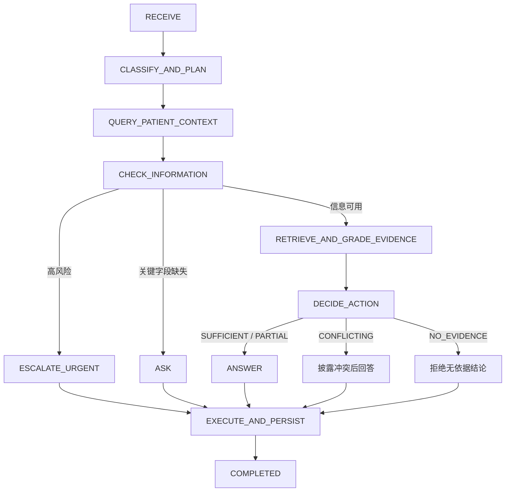
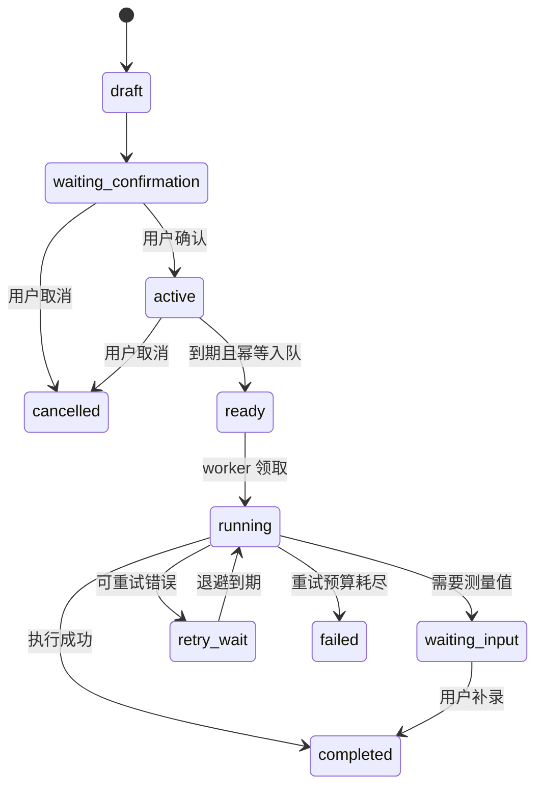

# HealthTrace Agent 与长期任务架构

## 咨询状态机

`backend/agent/orchestrator.py` 是咨询生命周期的权威编排器。`backend/rag/pipeline.py` 仍负责检索子图，两者不是重复实现：前者决定本轮应做什么，后者负责如何获取和修正公共医学证据。

每轮 `rag_trace` 保存状态迁移、Evidence State、Action、策略原因和脱敏工具审计。高风险与关键患者字段缺失在 LLM 前旁路；检索明确返回无结果时，状态机会替换掉缺少依据的确定性回答。

## 长期任务状态

PostgreSQL 中的 `health_task_runs` 是持久队列。`task_id + run_key` 防止重复入队，PostgreSQL worker 使用 `SKIP LOCKED` 防止并发重复领取；失败按 30、60、120 秒指数退避，默认最多三次。提醒、随访、测量计划、周期摘要和目标检查均生成可恢复的站内通知，通知使用 dedup key 保证幂等。

当前站内通知已闭环；短信、邮件和移动推送只需在执行器后增加 channel adapter，不改变任务状态机。所有写操作继续受 tenant/patient scope 和用户确认约束。
