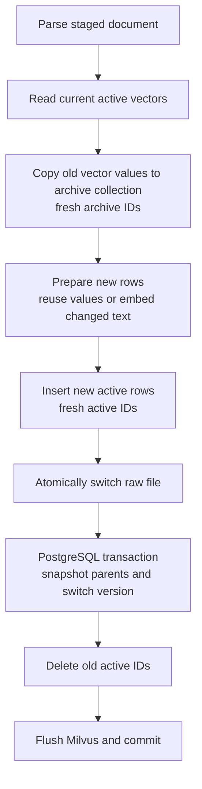

# Reversible Incremental Document Updates

## Identity Model

HealthTrace deliberately does not reuse a Milvus primary key.

- `id`: physical Milvus row ID generated by `auto_id=True`.
- `content_fingerprint`: SHA-256 of the exact canonical text sent to embedding.
- `placement_fingerprint`: SHA-256 of page, section, parent, root, and structure metadata.
- `chunk_id`: business chunk identity used by PostgreSQL parent-child relations.
- `document_version`: logical document version.

When text is unchanged, HealthTrace reads the old `dense_embedding` value and
inserts it into a new row. The new version therefore receives a new Milvus ID.
When placement changes, the vector can still be reused, but the new
`chunk_id`, `parent_chunk_id`, and parent snapshot are always written.

## Canonical Text Boundary

`backend/indexing/text_normalization.py` is the single normalization boundary
for both embedding input and fingerprints:

1. Unicode NFKC normalizes width-compatible characters.
2. Tabs, newlines, and repeated spaces collapse to one space.
3. Optional volatile metadata lines can be excluded with
   `DOCUMENT_EMBEDDING_IGNORE_LINE_PATTERNS`; rules are separated by `;;`.
4. The rule-set hash is included in `embedding_normalization_version`.

Changing the normalization rules invalidates reuse and forces one re-embedding
cycle. File metadata is not automatically added to the content fingerprint.

## Update Saga



The operation is a cross-store Saga, not distributed ACID. Every write has a
reverse compensation. Milvus reads use strong consistency, deletes flush
before returning, and retrieval over-fetches then deduplicates overlapping
business content by document and fingerprint.

## Cold Retention And Rollback

Superseded vector values are copied to a separate archive collection and kept
for seven days by default. PostgreSQL keeps a parent-chunk snapshot per
`DocumentVersion`, while the previous raw file is retained under `.versions/`.

Rollback reads archived vector values, inserts fresh active rows with fresh
Milvus IDs, restores the raw file and parent snapshot, then archives and
supersedes the formerly active version.

```text
POST /documents/{filename}/versions/{version}/rollback
POST /patient/documents/{document_id}/versions/{version}/rollback
```

Patient rollback first applies tenant, patient, and write-scope verification.

## Expiration

The scheduler periodically removes expired vectors from archive collections.
It does not automatically delete raw files, parent snapshots, or version audit
rows. This keeps cleanup bounded and avoids unsafe bulk file deletion.

```cmd
.venv\Scripts\python.exe scripts\migrate_phase8_reversible_documents.py apply
.venv\Scripts\python.exe scripts\purge_expired_document_versions.py
.venv\Scripts\python.exe scripts\purge_expired_document_versions.py --execute
```

The purge command is dry-run unless `--execute` is supplied.
